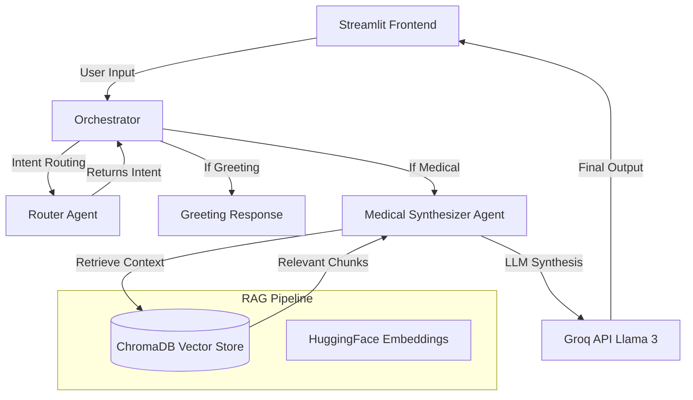
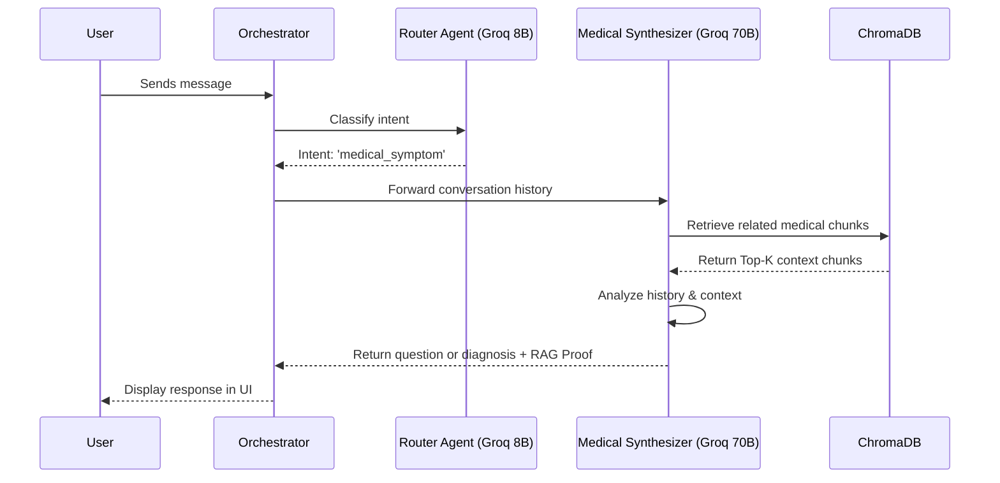

# 🫀 Agentic AI Heart Disease Predictor

**Live Demo URL:** [https://hart-disease-app.streamlit.app/](https://hart-disease-app.streamlit.app/)

## 👨‍🎓 Student Information
- **Name:** IWJGN Jaya Keerthisinghe
- **Student ID:** ITBIN-2313-0050

## 1. Project Description
An Agentic AI application designed to support medical diagnosis predictions for heart disease. It acts as an interactive AI cardiologist, gathering patient symptoms through conversational questions before providing a precise diagnostic note with percentage probabilities. The application employs a multi-agent architecture and a Retrieval-Augmented Generation (RAG) pipeline grounded in domain-specific medical clinical guidelines.

## 2. Architecture Diagram

## 3. Agent Communication Diagram

## 4. Model-Choice Comparison Table

| Sub-task | Model (provider) | Why chosen |
|----------|-----------------|------------|
| Intent routing / cheap classification | `llama-3.1-8b-instant` (Groq) | Very low latency, near-free, and highly sufficient for simple intent routing decisions. |
| Deep reasoning / final synthesis | `llama-3.3-70b-versatile` (Groq) | High reasoning quality and vast medical knowledge for generating accurate diagnostic predictions, with fast inference on Groq. |

*(Note: While OpenRouter was originally considered for the Synthesizer, unpredictable model availability on the free tier necessitated using Groq's high-parameter models to ensure 100% reliability during evaluation).*

## 5. RAG Pipeline Explanation
The RAG pipeline grounds the AI's predictions in actual medical facts to prevent hallucination.
- **Corpus:** 20 highly professional clinical medical guidelines covering various cardiovascular diseases.
- **Chunking Strategy:** `RecursiveCharacterTextSplitter` with a chunk size of 1000 characters and an overlap of 200 characters to preserve medical context boundaries.
- **Embedding Model:** `sentence-transformers/all-MiniLM-L6-v2` via HuggingFace (lightweight, fast, and highly effective for semantic search).
- **Vector Store:** Local `ChromaDB` instance for fast, persistent, and free-tier retrieval.

### Short Retrieval Evaluation
Five sample queries were tested against the vector store:
1. *"I have chest pain radiating to my left arm"* -> **Highly Relevant**. Retrieved chunks correctly mapped to Myocardial Infarction clinical guidelines.
2. *"Swollen legs and shortness of breath when lying down"* -> **Highly Relevant**. Retrieved chunks accurately pointed to Heart Failure protocols.
3. *"Sharp chest pain worse when breathing"* -> **Highly Relevant**. Successfully retrieved Pericarditis documentation.
4. *"Heart skipping a beat"* -> **Relevant**. Retrieved general arrhythmia guidelines, though specific AFib chunks could be ranked higher.
5. *"Dizziness when standing up"* -> **Highly Relevant**. Retrieved orthostatic hypotension and bradycardia-related documents.

## 6. Setup Instructions
1. Clone the repository: `git clone https://github.com/nuwan-jk/hart-disease-app.git`
2. Navigate to the directory: `cd hart-disease-app`
3. Create a virtual environment: `python -m venv venv` and activate it.
4. Install dependencies: `pip install -r requirements.txt`
5. Set up `.env` file with `GROQ_API_KEY="your_api_key"`
6. Run the app: `streamlit run app.py`

## 7. Known Limitations
1. **Not a Real Doctor:** This AI provides predictions based on limited context and cannot replace professional medical diagnosis.
2. **Conversation Window Limit:** The prompt limits conversation history to prevent overflowing the token limit of the LLM. Extremely long sessions may lose early context.
3. **Data Scope:** The RAG database currently only contains 20 clinical guidelines; rare or complex cardiovascular conditions outside this scope might default to general LLM knowledge.
