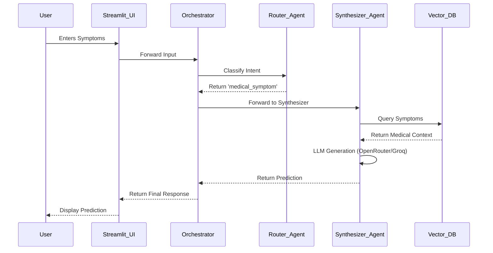

# Heart Disease Prediction App 🫀

This Agentic AI application helps predict potential heart diseases based on user-provided symptoms. It uses a Retrieval-Augmented Generation (RAG) pipeline combined with an Agentic workflow to synthesize accurate medical predictions.

## Architecture

We use a modular architecture involving a Streamlit UI, a RAG vector store (ChromaDB), and an Agent Orchestrator.

### Agent Communication Diagram (Mermaid)



## Setup Instructions

1. Clone the repository.
2. Ensure you have `uv` installed, or use standard Python.
3. Install dependencies: `uv pip install -r requirements.txt` (or `pip install -r requirements.txt`).
4. Set your API keys in a `.env` file in the root directory:
   ```
   GROQ_API_KEY=your_groq_key
   OPENROUTER_API_KEY=your_openrouter_key
   ```
5. Run the synthetic data generator and ingest to RAG:
   ```
   python generate_data.py
   python rag.py
   ```
6. Start the application:
   ```
   streamlit run app.py
   ```

## Model Selection Strategy

| Sub-task | Model (provider) | Why chosen |
|----------|------------------|------------|
| Intent Routing | Llama-3.1-8B (Groq) | Very low latency, free, perfect for simple intent classification. |
| Final Synthesis | Claude 3 Haiku / Llama 3 70B (OpenRouter/Groq) | Higher reasoning quality required for medical synthesis, justifies a slightly larger model. |
| RAG Embeddings | all-MiniLM-L6-v2 (HuggingFace Local) | Runs locally, fast, completely free and avoids API latency for simple text chunking. |

## RAG Pipeline

- **Corpus**: 20 synthetic text documents detailing various heart conditions and their symptoms.
- **Chunking**: `RecursiveCharacterTextSplitter` with 500 characters and 50 character overlap.
- **Embeddings**: `HuggingFaceEmbeddings` (all-MiniLM-L6-v2).
- **Vector Store**: `Chroma` (persisted locally).

## Known Limitations
- The medical data is synthetic and limited to 20 documents.
- Not a replacement for professional medical advice.
- Streamlit Community Cloud deployment requires setting secrets manually via the web interface.
